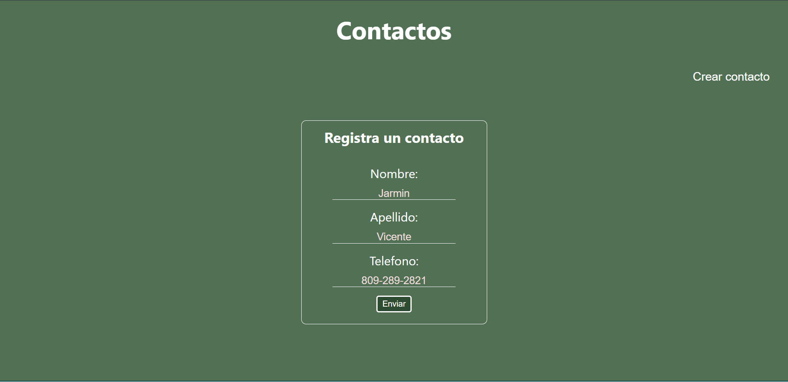

## Tarea #4 - Basilio Gianfranco De Paula Cuevas (2020-10552)

### Agenda React 

Haga nueva vez la agenda pautada en la tarea #3 pero esta vez utilice la librería de Javascript React. Haga un componente para mostrar el listado de contactos y un componente para agregar nuevos contactos. Ambos componentes estarán contenidos en un componente padre.

